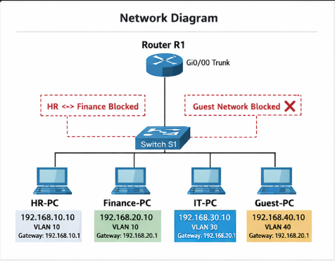

# 🖧 Enterprise Network Segmentation & VLAN Security Lab  
**Author:** Junist Aurelien  
**Project Date:** February 13, 2026  
**Platform:** Cisco Packet Tracer  
**Domain:** Network Security | Segmentation | ACL Enforcement  

---

## 📌 Overview

This project simulates a small enterprise network implementing:

- VLAN segmentation  
- Inter-VLAN routing (Router-on-a-Stick)  
- Access Control Lists (ACLs)  
- Traffic restriction policies  
- Validation testing (allowed vs blocked traffic)  

The objective was to demonstrate how organizations reduce lateral movement risk through logical network segmentation and policy enforcement.

---

## 🏢 Business Scenario

A small company contains four departments:

- HR  
- Finance  
- IT  
- Guest Network  

Security Requirements:

- IT has full administrative network access  
- HR and Finance are isolated from one another  
- Guest network is fully restricted from internal systems  
- Departments only access what policy allows  

---

## 🌐 Network Architecture

| VLAN | Department | Subnet | Gateway |
|------|------------|--------|----------|
| 10 | HR | 192.168.10.0/24 | 192.168.10.1 |
| 20 | Finance | 192.168.20.0/24 | 192.168.20.1 |
| 30 | IT | 192.168.30.0/24 | 192.168.30.1 |
| 40 | Guest | 192.168.40.0/24 | 192.168.40.1 |

---

---

## 🖧 Enterprise Network Segmentation Diagram

  

---

---

## 🔧 Core Configurations

### VLAN Creation (Switch)

- VLAN 10 → HR  
- VLAN 20 → Finance  
- VLAN 30 → IT  
- VLAN 40 → Guest  

### Router-on-a-Stick

Subinterfaces configured using 802.1Q encapsulation.

### ACL Policy Enforcement

Extended ACL 100 applied inbound on router trunk interface.

---

## 🔐 Access Control Policy

| Source | Destination | Result |
|--------|-------------|--------|
| IT | HR | Allowed |
| IT | Finance | Allowed |
| HR | Finance | Blocked |
| Guest | Any Internal Network | Blocked |

---

## 🧪 Validation Testing

Successful:

- IT → HR (Ping Success)
- IT → Finance (Ping Success)

Blocked:

- HR → Finance (Denied)
- Guest → HR (Denied)

Screenshots available in `/screenshots`

---

